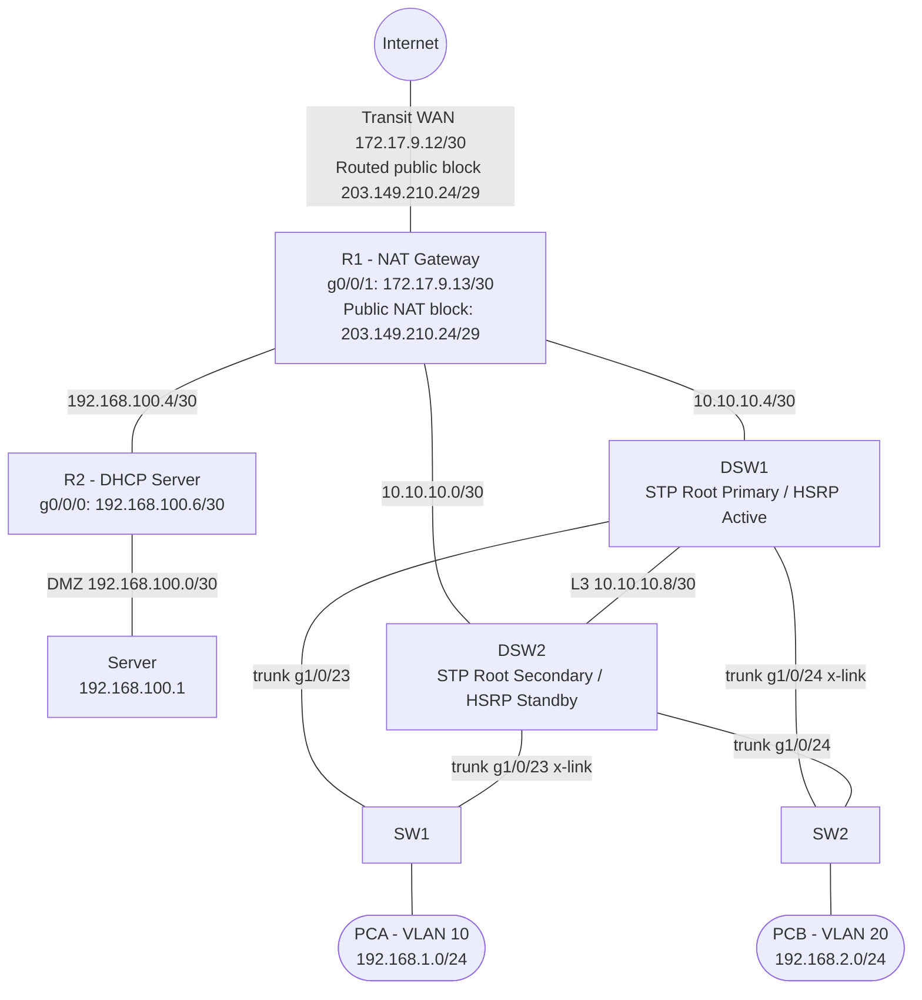

#transcend=attackjer
#sandisk=vpn
#sd=victim
this took 15k tokens btw

###DO NOT EDIT ABOVE CLAUDE

SW1

en
conf t
hostname SW1
vlan 10
 name VLAN10
vlan 20
 name VLAN20
vlan 30
 name Marketing
vlan 40
 name Networking
spanning-tree mode rapid-pvst
spanning-tree vlan 10,20,30,40 priority 61440
int g1/0/23
 switchport mode trunk
 switchport trunk allowed vlan 10,20,30,40
 no shutdown
int g1/0/24
 switchport mode trunk
 switchport trunk allowed vlan 10,20,30,40
 no shutdown
interface range g1/0/1-22
 no shutdown
end

SW2

en
conf t
hostname SW2
vlan 10
 name VLAN10
vlan 20
 name VLAN20
vlan 30
 name Marketing
vlan 40
 name Networking
spanning-tree mode rapid-pvst
spanning-tree vlan 10,20,30,40 priority 61440
int g1/0/23
 switchport mode trunk
 switchport trunk allowed vlan 10,20,30,40
 no shutdown
int g1/0/24
 switchport mode trunk
 switchport trunk allowed vlan 10,20,30,40
 no shutdown
interface range g1/0/1-22
 no shutdown
end

DSW1

en
conf t
hostname DSW1
vlan 10
 name VLAN10
vlan 20
 name VLAN20
vlan 30
 name Marketing
vlan 40
 name Networking
spanning-tree mode rapid-pvst
spanning-tree vlan 10,20,30,40 root primary
ip routing
router ospf 1
 router-id 3.3.3.3

interface g1/0/1
 no switchport
 ip address 10.10.10.5 255.255.255.252
 ip ospf 1 area 0
 ip ospf network point-to-point
 no shutdown

interface g1/0/12
 no switchport
 ip address 10.10.10.9 255.255.255.252
 ip ospf 1 area 0
 ip ospf network point-to-point
 no shutdown

interface g1/0/23
 switchport mode trunk
 switchport trunk allowed vlan 10,20,30,40
 no shutdown

interface g1/0/24
 switchport mode trunk
 switchport trunk allowed vlan 10,20,30,40
 no shutdown

interface Vlan10
 ip address 192.168.1.2 255.255.255.0
 standby 10 ip 192.168.1.1
 standby 10 priority 110
 standby 10 preempt
 ip helper-address 192.168.100.6
 ip ospf 1 area 0
 no shutdown

interface Vlan20
 ip address 192.168.2.2 255.255.255.0
 standby 20 ip 192.168.2.1
 standby 20 priority 110
 standby 20 preempt
 ip helper-address 192.168.100.6
 ip ospf 1 area 0
 no shutdown

interface Vlan30
 ip address 192.168.3.2 255.255.255.248
 standby 30 ip 192.168.3.1
 standby 30 priority 110
 standby 30 preempt
 ip helper-address 192.168.100.6
 ip ospf 1 area 0
 no shutdown

interface Vlan40
 ip address 192.168.4.2 255.255.255.128
 standby 40 ip 192.168.4.1
 standby 40 priority 110
 standby 40 preempt
 ip helper-address 192.168.100.6
 ip ospf 1 area 0
 no shutdown
end

DSW2

en
conf t
hostname DSW2
vlan 10
 name VLAN10
vlan 20
 name VLAN20
vlan 30
 name Marketing
vlan 40
 name Networking
spanning-tree mode rapid-pvst
spanning-tree vlan 10,20,30,40 root secondary
ip routing
router ospf 1
 router-id 4.4.4.4

interface g1/0/2
 no switchport
 ip address 10.10.10.1 255.255.255.252
 ip ospf 1 area 0
 ip ospf network point-to-point
 no shutdown

interface g1/0/12
 no switchport
 ip address 10.10.10.10 255.255.255.252
 ip ospf 1 area 0
 ip ospf network point-to-point
 no shutdown

interface g1/0/23
 switchport mode trunk
 switchport trunk allowed vlan 10,20,30,40
 no shutdown

interface g1/0/24
 switchport mode trunk
 switchport trunk allowed vlan 10,20,30,40
 no shutdown

interface Vlan10
 ip address 192.168.1.3 255.255.255.0
 standby 10 ip 192.168.1.1
 standby 10 priority 90
 standby 10 preempt
 ip helper-address 192.168.100.6
 ip ospf 1 area 0
 no shutdown

interface Vlan20
 ip address 192.168.2.3 255.255.255.0
 standby 20 ip 192.168.2.1
 standby 20 priority 90
 standby 20 preempt
 ip helper-address 192.168.100.6
 ip ospf 1 area 0
 no shutdown

interface Vlan30
 ip address 192.168.3.3 255.255.255.248
 standby 30 ip 192.168.3.1
 standby 30 priority 90
 standby 30 preempt
 ip helper-address 192.168.100.6
 ip ospf 1 area 0
 no shutdown

interface Vlan40
 ip address 192.168.4.3 255.255.255.128
 standby 40 ip 192.168.4.1
 standby 40 priority 90
 standby 40 preempt
 ip helper-address 192.168.100.6
 ip ospf 1 area 0
 no shutdown
end

R1

en
conf t
hostname R1
router ospf 1
 router-id 1.1.1.1
 default-information originate always

ip route 0.0.0.0 0.0.0.0 172.17.9.14
ip nat inside source static 192.168.100.1 203.149.210.25

! Link to R2 (192.168.100.4/30)
interface g0/0/0
 ip address 192.168.100.5 255.255.255.252
 ip nat inside
 ip ospf 1 area 0
 ip ospf network point-to-point
 no shutdown

interface g0/0/1
 ip address 172.17.9.13 255.255.255.252
 ip nat outside
 ip ospf 1 area 0
 no shutdown

interface g0/1/0
 ip address 10.10.10.6 255.255.255.252
 ip nat inside
 ip ospf 1 area 0
 ip ospf network point-to-point
 no shutdown

interface g0/1/1
 ip address 10.10.10.2 255.255.255.252
 ip nat inside
 ip ospf 1 area 0
 ip ospf network point-to-point
 no shutdown

ip nat pool NAT_POOL 203.149.210.26 203.149.210.30 netmask 255.255.255.248
ip access-list standard NAT_ACL
 permit 192.168.1.0 0.0.0.255
 permit 192.168.2.0 0.0.0.255
 permit 192.168.3.0 0.0.0.7
 permit 192.168.4.0 0.0.0.127
ip nat inside source list NAT_ACL pool NAT_POOL overload
end

R2

en
conf t
hostname R2
router ospf 1
 router-id 2.2.2.2

interface g0/0/0
 ip address 192.168.100.6 255.255.255.252
 ip ospf 1 area 0
 ip ospf network point-to-point
 no shutdown

interface g0/0/1
 ip address 192.168.100.2 255.255.255.252
 ip ospf 1 area 0
 ip ospf network point-to-point
 no shutdown

ip dhcp excluded-address 192.168.1.1 192.168.1.3
ip dhcp excluded-address 192.168.2.1 192.168.2.3
ip dhcp excluded-address 192.168.3.1 192.168.3.3
ip dhcp excluded-address 192.168.4.1 192.168.4.3

ip dhcp pool VLAN10
 network 192.168.1.0 255.255.255.0
 default-router 192.168.1.1
 lease 1

ip dhcp pool VLAN20
 network 192.168.2.0 255.255.255.0
 default-router 192.168.2.1
 lease 1

ip dhcp pool VLAN30
 network 192.168.3.0 255.255.255.248
 default-router 192.168.3.1
 lease 1

ip dhcp pool VLAN40
 network 192.168.4.0 255.255.255.128
 default-router 192.168.4.1
 lease 1
end

---

---

## Port Mapping

| Device | Local Port  | Destination | Dst Port    | Link                       |
|--------|-------------|-------------|-------------|----------------------------|
| R1     | g0/0/0      | R2          | g0/0/0      | 192.168.100.4/30           |
| R1     | g0/0/1      | Internet    | -           | Transit WAN 172.17.9.12/30; public NAT block 203.149.210.24/29 |
| R1     | g0/1/0      | DSW1        | g1/0/1      | L3 10.10.10.4/30           |
| R1     | g0/1/1      | DSW2        | g1/0/2      | L3 10.10.10.0/30           |
| R2     | g0/0/0      | R1          | g0/0/0      | 192.168.100.4/30           |
| R2     | g0/0/1      | Server      | -           | DMZ 192.168.100.0/30       |
| DSW1   | g1/0/1      | R1          | g0/1/0      | L3 10.10.10.4/30           |
| DSW1   | g1/0/12     | DSW2        | g1/0/12     | L3 10.10.10.8/30           |
| DSW1   | g1/0/23     | SW1         | g1/0/23     | Trunk VLANs 10,20,30,40    |
| DSW1   | g1/0/24     | SW2         | g1/0/23     | Trunk x-link VLANs 10,20,30,40 |
| DSW2   | g1/0/2      | R1          | g0/1/1      | L3 10.10.10.0/30           |
| DSW2   | g1/0/12     | DSW1        | g1/0/12     | L3 10.10.10.8/30           |
| DSW2   | g1/0/23     | SW1         | g1/0/24     | Trunk x-link VLANs 10,20,30,40 |
| DSW2   | g1/0/24     | SW2         | g1/0/24     | Trunk VLANs 10,20,30,40    |
| SW1    | g1/0/23     | DSW1        | g1/0/23     | Trunk VLANs 10,20,30,40    |
| SW1    | g1/0/24     | DSW2        | g1/0/23     | Trunk x-link VLANs 10,20,30,40 |
| SW1    | g1/0/1-22   | PCA         | —           | Access VLAN 10             |
| SW2    | g1/0/23     | DSW1        | g1/0/24     | Trunk x-link VLANs 10,20,30,40 |
| SW2    | g1/0/24     | DSW2        | g1/0/24     | Trunk VLANs 10,20,30,40    |
| SW2    | g1/0/1-22   | PCB         | —           | Access VLAN 20             |

en
write erase
reload
Student@s1t
