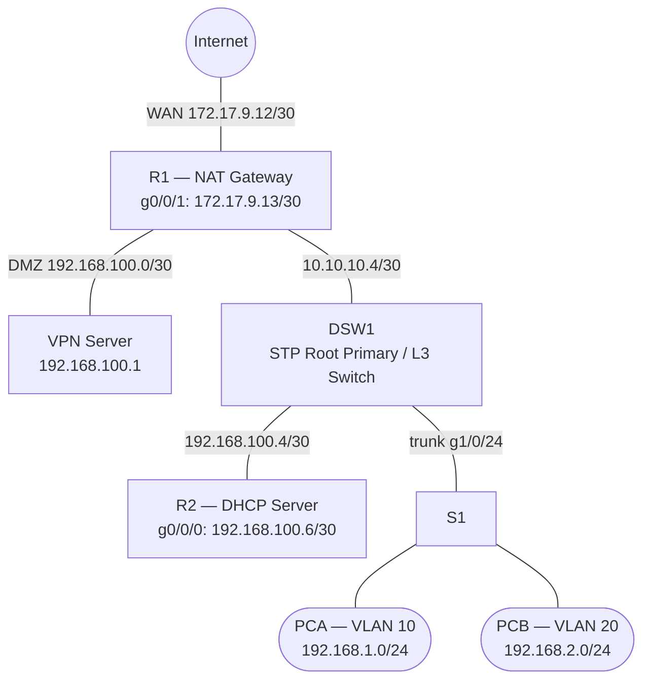

#transcend=attackjer
#sandisk=vpn
#sd=victim

https://docs.google.com/document/d/1XUnHJ_M1wCz90MIbPeqOzpmUXQBvzkyq/edit?usp=sharing&ouid=111394012869341403431&rtpof=true&sd=true

rack 1c isp1

en
write erase
reload
Student@s1t
Student@s1t

###DO NOT EDIT ABOVE CLAUDE

S1

en
conf t
hostname S1
vlan 10
 name VLAN10
vlan 20
 name VLAN20
vlan 30
 name VLAN30
vlan 40
 name VLAN40
spanning-tree mode rapid-pvst
spanning-tree vlan 10,20,30,40 priority 61440
interface g1/0/24
 switchport mode trunk
 switchport trunk allowed vlan 10,20,30,40
 no shutdown
interface range g1/0/1-12
 switchport access vlan 10
 no shutdown
interface range g1/0/13-18
 switchport access vlan 20
 no shutdown
interface range g1/0/19-20
 switchport access vlan 40
 no shutdown
interface range g1/0/21-22
 switchport access vlan 40
 no shutdown
end

DSW1

en
conf t
hostname DSW1
vlan 10
 name VLAN10
vlan 20
 name VLAN20
vlan 30
 name VLAN30
vlan 40
 name VLAN40
spanning-tree mode rapid-pvst
spanning-tree vlan 10,20,30,40 root primary
ip routing
router ospf 1
 router-id 2.2.2.2

interface g1/0/1
 no switchport
 ip address 10.10.10.5 255.255.255.252
 ip ospf 1 area 0
 ip ospf network point-to-point
 no shutdown

interface g1/0/2
 no switchport
 ip address 192.168.100.5 255.255.255.252
 ip ospf 1 area 0
 ip ospf network point-to-point
 no shutdown

interface g1/0/24
 switchport mode trunk
 switchport trunk allowed vlan 10,20,30,40
 no shutdown

interface Vlan10
 ip address 192.168.1.1 255.255.255.0
 ip helper-address 192.168.100.6
 ip ospf 1 area 0
 no shutdown

interface Vlan20
 ip address 192.168.2.1 255.255.255.0
 ip helper-address 192.168.100.6
 ip ospf 1 area 0
 no shutdown

interface Vlan30
 ip address 192.168.3.1 255.255.255.248
 ip helper-address 192.168.100.6
 ip ospf 1 area 0
 no shutdown

interface Vlan40
 ip address 192.168.4.1 255.255.255.128
 ip helper-address 192.168.100.6
 ip ospf 1 area 0
 no shutdown
end

R1

en
conf t
hostname R1
router ospf 1
 router-id 1.1.1.1
 default-information originate always

ip route 0.0.0.0 0.0.0.0 172.17.9.14

! DMZ - VPN server (192.168.100.0/30)
interface g0/0/0
 ip address 192.168.100.2 255.255.255.252
 ip nat inside
 ip ospf 1 area 0
 ip ospf network point-to-point
 no shutdown

interface g0/0/1
 ip address 172.17.9.13 255.255.255.252
 ip nat outside
 no shutdown

interface g0/1/0
 ip address 10.10.10.6 255.255.255.252
 ip nat inside
 ip ospf 1 area 0
 ip ospf network point-to-point
 no shutdown

ip nat pool NAT_POOL 203.149.210.25 203.149.210.30 netmask 255.255.255.248
access-list 1 permit 192.168.0.0 0.0.255.255
ip nat inside source list 1 pool NAT_POOL overload
ip nat inside source static 192.168.100.1 203.149.210.24
end

R2

en
conf t
hostname R2

ip route 0.0.0.0 0.0.0.0 192.168.100.5

interface g0/0/0
 ip address 192.168.100.6 255.255.255.252
 no shutdown

ip dhcp excluded-address 192.168.1.1 192.168.1.3
ip dhcp excluded-address 192.168.2.1 192.168.2.3
ip dhcp excluded-address 192.168.3.1 192.168.3.3
ip dhcp excluded-address 192.168.4.1 192.168.4.3

ip dhcp pool VLAN10
 network 192.168.1.0 255.255.255.0
 default-router 192.168.1.1
 dns-server 8.8.8.8
 lease 1

ip dhcp pool VLAN20
 network 192.168.2.0 255.255.255.0
 default-router 192.168.2.1
 dns-server 8.8.8.8
 lease 1

ip dhcp pool VLAN30
 network 192.168.3.0 255.255.255.248
 default-router 192.168.3.1
 dns-server 8.8.8.8
 lease 1

ip dhcp pool VLAN40
 network 192.168.4.0 255.255.255.128
 default-router 192.168.4.1
 dns-server 8.8.8.8
 lease 1
end

---

---

## Port Mapping

| Device | Local Port  | Destination | Dst Port    | Link                         |
|--------|-------------|-------------|-------------|------------------------------|
| R1     | g0/0/0      | VPN Server  | —           | DMZ 192.168.100.0/30         |
| R1     | g0/0/1      | Internet    | —           | WAN 172.17.9.12/30           |
| R1     | g0/1/0      | DSW1        | g1/0/1      | L3 10.10.10.4/30             |
| R2     | g0/0/0      | DSW1        | g1/0/2      | 192.168.100.4/30             |
| DSW1   | g1/0/1      | R1          | g0/1/0      | L3 10.10.10.4/30             |
| DSW1   | g1/0/2      | R2          | g0/0/0      | 192.168.100.4/30             |
| DSW1   | g1/0/24     | S1          | g1/0/24     | Trunk VLANs 10,20,30,40      |
| S1     | g1/0/24     | DSW1        | g1/0/24     | Trunk VLANs 10,20,30,40      |
| S1     | g1/0/1-10   | PCA         | —           | Access VLAN 10               |
| S1     | g1/0/11-22  | PCB         | —           | Access VLAN 20               |

